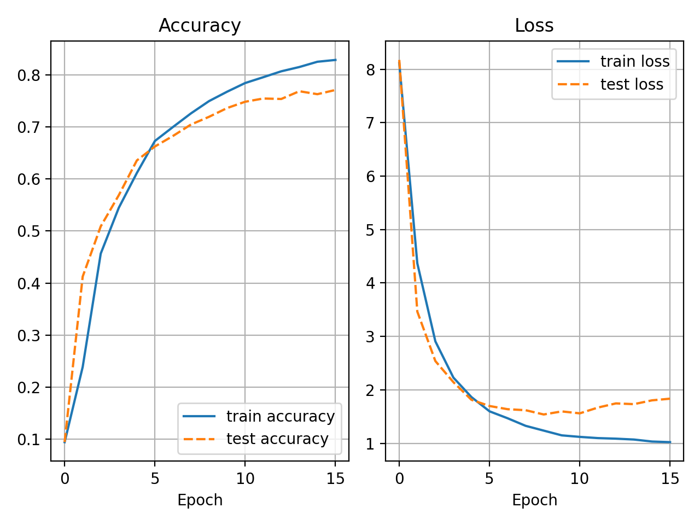
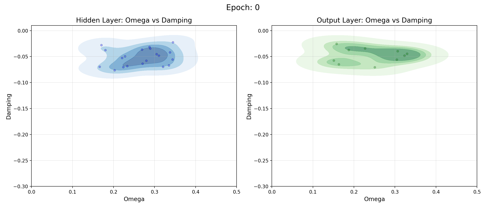
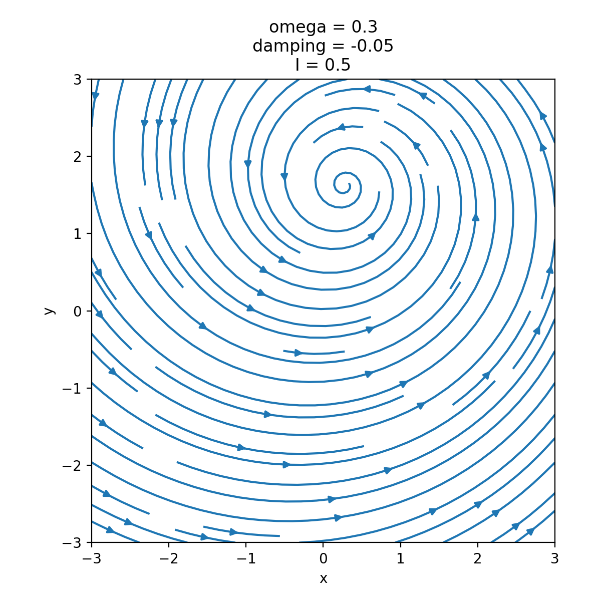
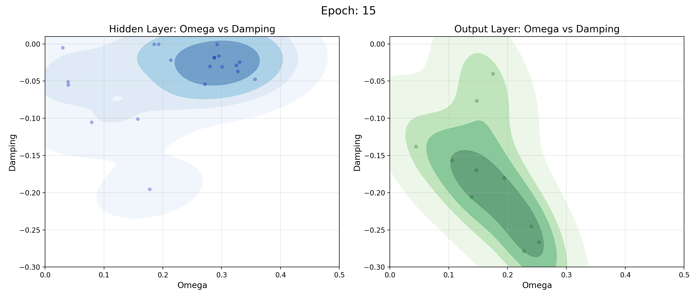
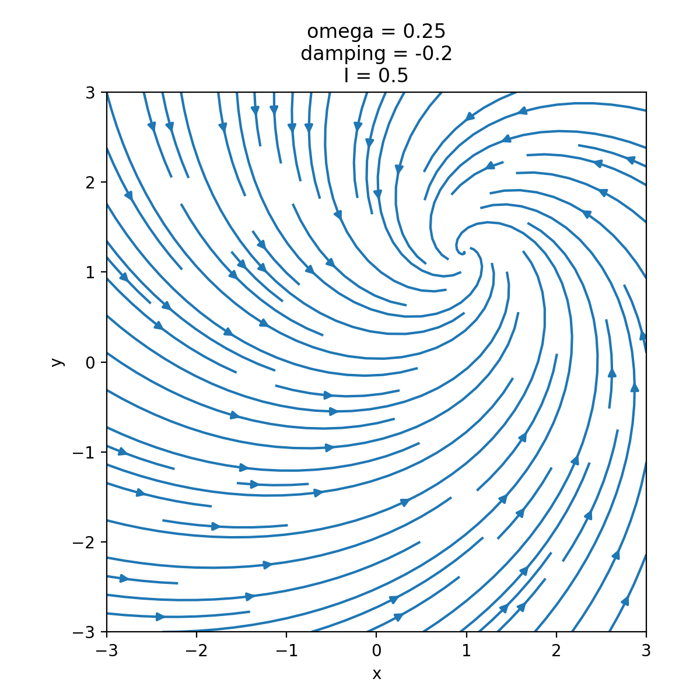

# ResonatorNet: End-to-End Training of Resonant-and-Fire Neural Networks

The project explores whether a differentiable spiking neuron can learn to distinguish integrator and resonator dynamics purely through backpropagation, applied to temporal pattern detection on Neuromorphic MNIST. We use a Resonant-and-Fire (RF) neuron, whose membrane dynamics are governed by omega (frequency) and a damping parameter. Omega determines whether the neuron behaves as an integrator or resonator: when omega = 0, the neuron reduces to a simple integrator; for any non-zero omega, it behaves as a resonator, oscillating at that characteristic frequency. Spikes are generated by a threshold mechanism with a custom surrogate gradient, allowing the model to be trained end-to-end with standard backpropagation. Critically, omega and damping are learned jointly with the weights, so the network can discover, purely from data, which neurons should specialise as resonant frequency-detectors (nonzero omega) versus simple integrators (omega = 0), rather than having this behaviour fixed in advance. The RF neuron uses the same scaling as a standard LIF neuron, making it well-suited to the binary spike inputs of Neuromorphic MNIST.  

#### Plotting 

Figure A: Training and test accuracy/lost over epochs: 
Both train and test accuracy increase steadily over the 15 training epochs, with training accuracy reaching approximately 83 % and test accuracy plateauing around 77 %. The corresponding loss curves show a similar trend: training loss decreases monotonically throughout training, while test loss decreases initially bit begins to plateau and slightly increase after around epoch 10. Despite this divergence, the gap between train and test performance remains modest, suggesting the RF neuron's learned omega/damping parameters generalise reasonably well to unseen samples rather than simply memorising the training set.
  
  
Figure B: Learned omega/damping distributions (KDE, Epoch 0): 
The kernel density plots show the joint distribution of omega and damping across neurons in the hidden and output layers at the start of training. At epoch 0, hidden and output layer neurons cluster in a similar region (omega ~ 0.15-0.4, damping ~ -0.02 to -0.08). Since all neurons start with nonzero omega, they begin in a resonator-like regime, meaning any shift toward integrator behaviour (omega -> 0) must emerge during training.  
  
  
Figure C: Phase portrait for a single RF neuron (omega = 0.3, damping = -0.05, I = 0.5): 
This plot visualises the trajectory of the membrane state in the (x, y) phase plane for one representative resonator neuron. The spiralling trajectory converging toward a fixed point illustrates the damped oscillatory dynamics that characterise a resonator (the negative damping value causes the amplitude of oscillation to decay over time, while the nonzero omega governs the rotational frequency of the spiral). It's the direct contrast to the trivial trajectory of an integrator neuron (omega = 0), which would instead show simple exponential decay along a single axis with no rotation.  
  
  
Figure D: Learned omega/damping distributions (KDE, Epoch 15): 
By the end of training, the two layers diverge clearly. Hidden layer neurons split into two groups: one tight cluster near omega ~ 0.25-0.35 with mild damping (~ 0 to -0.05), and a more scattered group near omega ~ 0.03-0.2 with stronger damping (down to -0.2), suggesting emerging specialisation into resonator- and integrator-like roles. Output layer neurons show a clearer trend: as omega decreases, damping becomes substantially more negative, with a dense cluster around omega ~ 0.2-0.25 and damping ~ -0.25 to -0.3.  
  
  
Figure E: Phase portrait (omega = 0.25, damping = -0.2, I = 0.5):
Trajectory still spirals, confirming resonator behaviour, but converges to the fixed point must faster than at epoch 0 due to the stronger (more negative) damping. This matches the output layer trend above, meaning neurons there settle on parameter combinations with heavier damping, favouring quicker-decaying oscillations over sustained ones. 
